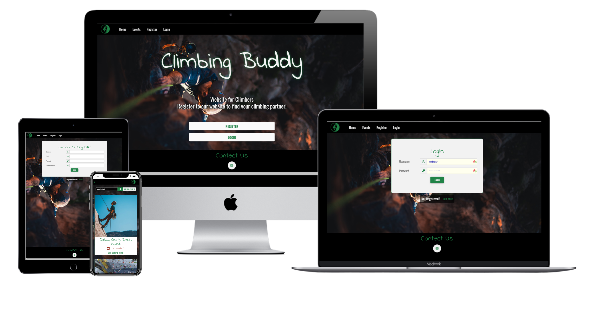
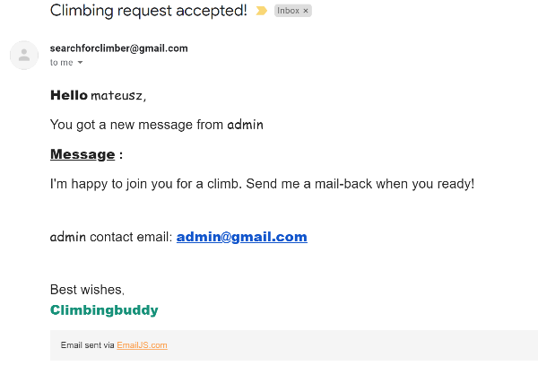
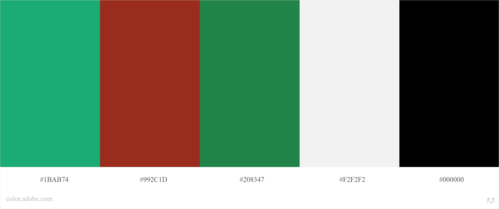
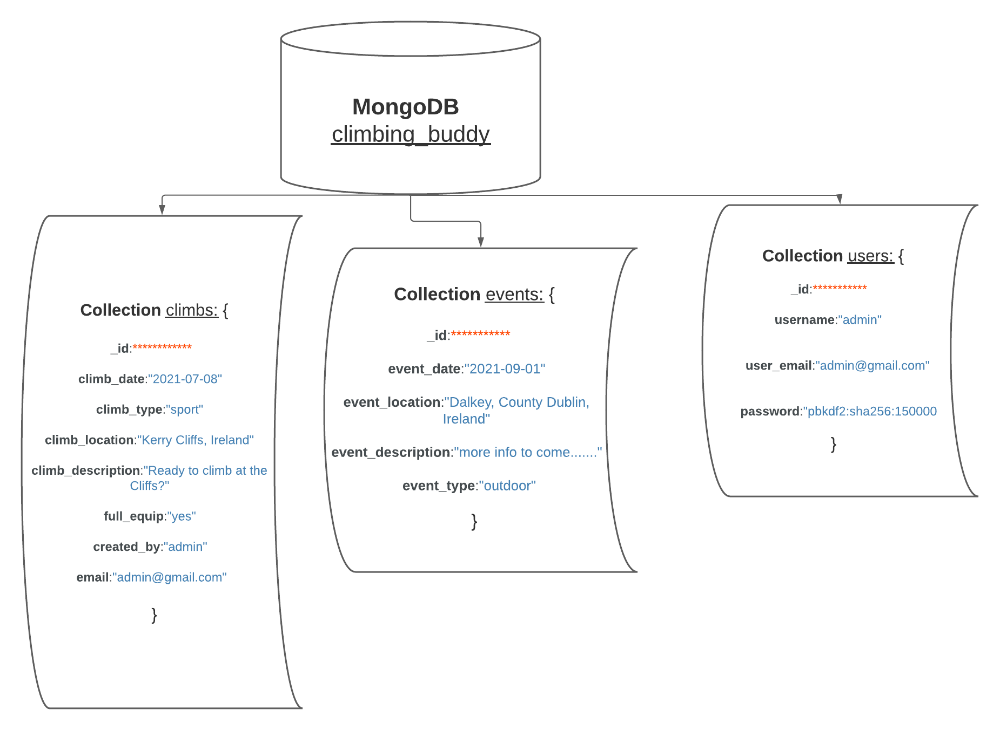
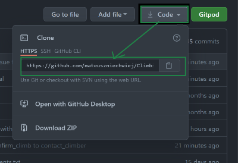
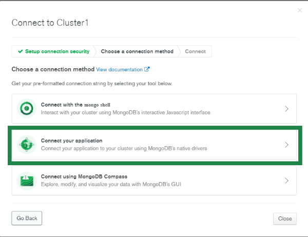
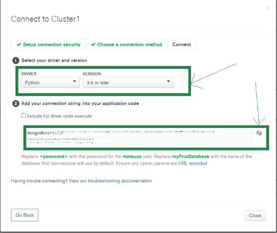

# Climbing Buddy

This website allows climbers in Ireland to find a climbing partner for chosen date and time. Registered users will be able to create a request to look for a climbing partner at chosen time and place.

:globe_with_meridians:[Live website](https://climbing-buddy-project.herokuapp.com/)

:page_facing_up:[GitHub repository](https://github.com/mateuszniechwiej/Climbing-Buddy)

# Table of Contest

- [Project Workflow](#project-workflow)
- [UX](#ux)
  - [The Strategy Plane](#the-strategy-plane)
    - [Project Goal](#project-goal)
    - [Site Goals](#site-goals)
    - [User Stories](#user-stories)
  - [The Scope Plane](#the-scope-plane)
    - [Planed Features](#planed-features)
  - [The Structure Plane](#the-structure-plane)
  - [The Skeleton Plane](#the-skeleton-plane)
    - [Wireframes](#wireframes)
  - [The Surface Plane](#the-surface-plane)
  - [Design](#design)
    - [Colour Scheme](#colour-scheme)
    - [Typography](#typography)
    - [Database Architecture](#database-architecture)
    - [Design Changes](#design-changes)
    - [Imagery](#imagery)
- [Features](#features)
  - [Existing Features](#existing-features)
  - [Future Features](#future-features)
- [Technologies Used](#technologies-used)
  - [Languages Used](#languages-used)
  - [Frameworks, Programmes and Libraries](#frameworks-programmes-and-libraries)
- [Testing](#testing)

  - [Testing Plan](#Testing-Plan)
  - [Testing Results](#Testing-Results)
  - [Issues](#issues)

- [Deployment](#deployment)
  - [Project Initiation](#project-initiation)
  - [Connecting to MongoDB](#connecting-to-mongodb)
  - [Heroku Deployment](#heroku-deployment)
- [Credits](#credits)
  - [Code](#code)
  - [Media](#media)
  - [Acknowledgements](#acknowledgements)

# UX

## The Strategy Plane

### _Project Goal_

This website project targets the climbing community in Ireland. The primary focus is to allow users to create a request to find a climbing partner- and check any climbing events created on this site.

### _Site Goals_

- To provide users with a simple- and easily navigated website to help them to create a request to find the correct partner for the climbing day.
- To increase the number of climbing events and allowing participating expanding network of new friends who share the same passion.
- Create a website fully responsive on mobiles, tablets, and desktop devices.

### _User Stories_

1. As a user, I want to understand the purpose of this website.

2. As a user, I want to find an easy navigate website and find all the content.

3. As a user, I want the website to be responsive and allow me to use it comfortably on all size devices(particularly mobiles phones).

4. As a user, I want to be able to register to the website and then create a request to look for a climbing partner.

5. As a user, I want to see if anyone created a request for a climbing partner.

6. As a user, I want to be able to select the requirements I have for a climbing person I'm looking for(skills, equipment and what type of climbing I want to do that day).

7. As a user, I would like to get notified once a person accepted my request.

8. As a user, I want to find about any climbing events taking place.

9. As a user, I want to be able to contact the site owner for any questions or suggestions I might have.

## The Scope Plane

### _Planed Features_

:one: Users able to register.

:two: Allow admin and users to login.

:three: Allow admin and users to create climbing partner search event.

:four: Allow users to read events created by others.

:five: Display Users profile.

:six: Climbing events displayed created by admin.

:seven: Allow users to accept events created by others.

:eight: Allow selecting date and hour for the climbing buddy search event.

:nine: MongoDB database to store information about users and profiles.

:one::zero: Responsive website with a navigation menu and website title.

| -   | Planed Feature                                                     | Importance | Viability/Feasibility |
| --- | ------------------------------------------------------------------ | ---------- | --------------------- |
| 1   | Users able to register                                             | 5          | 3                     |
| 2   | Allow admin and users to login                                     | 5          | 3                     |
| 3   | Allow admin and users to create climbing partner search event      | 5          | 4                     |
| 4   | Allow users to read and accept events created by others            | 4          | 5                     |
| 5   | Display Users profile                                              | 4          | 4                     |
| 6   | Climbing events displayed created by admin                         | 3          | 4                     |
| 7   | Allow users to accept events created by others                     | 3          | 5                     |
| 8   | Allow selecting date and hour for the climbing buddy search event  | 3          | 3                     |
| 9   | Use MongoDB database to store information about users and profiles | 5          | 4                     |
| 10  | Responsive website with a navigation menu and website title        | 5          | 2                     |

## The Structure Plane

### _Addresing users stories_

> As a user, I want to understand the purpose of this website.

A solution to satisfy user requirements:

- Top navigation menu in the Header displaying Home, Login, and Registration links.
- Caption Letters on the background image on the home page with a brief description of what the page purpose is

> As a user, I want to find an easy navigate website and find all the content.

A solution to satisfy user requirements:

- For unregistered users - a menu link for climbing events and registration would be available.

- For registered users additionally -

  - Option to display and create a climbing partner search

  - Display profile information

  - Logout menu link.

> As a user, I want the website to be responsive and allow me to use it comfortably on all size devices(particularly mobiles phones).

A solution to satisfy user requirements:

- Material Design for Bootstrap 5 will be used for this website to ensure all content is displayed correctly.

> As a user, I want to be able to register to the website so that I can create a request to look for a climbing partner.

A solution to satisfy user requirements:

- registration button will be available from the Homepage in the header navigation link.

> As a user, I want to see if anyone created a request for a climbing partner.

A solution to satisfy user requirements:

- for registered users page with climbing requests will be available.

> As a user, I want to be able to select the requirements I have for a climbing person I'm looking for(skills, equipment and what type of climbing I want to do that day).

A solution to satisfy user requirements:

- climber search request form will have options to select:
  - prefered climbing type: sport, traditional or bouldering.
  - equipment provided by the user who makes a request.
  - desire level of skills from the other climber.
  - dropdown list for climbing location.

> As a user, I would like to get notified once a person accepted my request.

A solution to satisfy user requirements:

- once the interested user clicks the `More Info` button from the find climber .The climb_info page where he can press `Contact Climber` details about the climb and have a a modal form with session username, email and message to fill out will appear for the user to submit. After submitting the modal form, an email will be sent to the climbing search event creator with the user name and email details of who accepted the request.

- emailjs.com will be used to send mail after accepting the climbing request.

* Example of an email received from user whom is intrested in cthe climb:

Comments: Feature implementation: private chat messages between users to be available for each climbing event so users emails don't need to be revealed(Consider solution: Sending private messages using Flask-SocketIO).

> As a user, I want to find about any climbing events taking place.

A solution to satisfy user requirements:

- climbing events created by the admin will be available for both registered and unregistered users.

> As a user, I want to be able to contact the site owner for any questions or suggestions I might have.

A solution to satisfy user requirements:

- an email and/or contact form will be available for any website users

## The Skeleton Plane

### _Wireframes_
[Wireframes](https://xd.adobe.com/view/b3b26688-13e3-4b8a-94fd-98b06524cdf9-e6e1/)

## The Surface Plane

### Design

#### Colour Scheme
* Used Adobe Color to choose the colour pallet.

#### Typography

:black_nib:

* The primary font used in this project is **'Indie Flower'**. A fun handwriting font easy to read with rounded edges. Which was what I was looking for in this project.

* The second font used for this website is **'Oswald'** with *sans-serif* as a fallback font. A readable and interesting font that fits best for body content.

#### Design Changes

### Database Architecture
* **MongoDB** non-relational database is used to store data for this project
* Database design for this project is based on three collections: 
    * __*users*__(stores: users name and email)
    * __*climbs*__(stores: climbs events(requests) raised by registered users)
    * __*events*__(stores: climbing events raised by _**admin**_)

### Imagery

Images for this project 
- [Background Image by Patrick Hendry](https://unsplash.com/photos/WrCvD2Cgb4c)
- [Outdoor Climbing Image by PatrickHendry](https://unsplash.com/photos/w5hNCbJfX3w)
- [Indoor Climbing by Pavel Danilyuk](https://www.pexels.com/photo/landscape-man-people-woman-7591312/)
## Features

### Existing Features

:one: The landing page displaying information about the website's purpose.

:two: Events page displaying three events per page.

:three: Create an events page available for the admin.

:four: Register and login functionality.

:five: Climbing events displaying three climbs per page.

:six: Add Find Climber request event available for all registered users.

:seven: Profile page with username name and email.

:eight: Message climber form using EmailJS functionality.

:nine: Email link on all pages to contact the website owner for any information needed.

:one::zero: Places Autocomplete by Google(a feature of Places library in the Maps JavaScript API) to look for locations in Ireland and the Uk only.

:one::one: Mobile responsive design.

:one::two: Error page to display error messages with website background.

:one::three: filter climbs functionality searched by categories selected.

:one::four: searched bar on events page to look for phrases in the events text.

:one::five: Google _**Place Autocomplete**_ functionality for each location input field in this project.

### Future Features

:one: Private chat messages between users to be available for each climbing event so users emails don't need to be revealed.

:two: A gallery page to allow the user to add photos from events and climbs.

## Technologies Used

### Languages Used

* [HTML5](https://en.wikipedia.org/wiki/HTML5)

* [CSS3](https://en.wikipedia.org/wiki/CSS)

* [JavaScript](https://pl.wikipedia.org/wiki/JavaScript)

* [Python](https://www.python.org/)

## Frameworks, Programmes and Libraries
* [mdbootstrap](https://mdbootstrap.com/) - Material Design for Bootstrap 5 used for layouts, styling and custom components such as forms, navigation bar or modals.
* [emailjs](https://www.emailjs.com/) -to allow users to respond to climbing request by sending an email message.
* [JIRA](https://www.atlassian.com/software/jira) - project management tool to organize workflow.

* [Adobe Photoshop Express](https://photoshop.adobe.com/?promoid=SYBNM1DC&mv=other) - To crop the full-page background image.
* [Adobe Xd](https://www.adobe.com/ie/products/xd/wireframing-tool.html#:~:text=Adobe%20XD%20is%20a%20powerful,all%20in%20one%20design%20tool.) - to create wireframes

* [Canva](https://www.canva.com/) - Canva was used to create logo for the website.
* [Lucidchart](https://www.lucidchart.com/) - used to create Database design diagram.
* [JPEG-OPTIMIZER](http://jpeg-optimizer.com/) - optimized the size of images used in this project.
* [techsini](https://techsini.com/) - to generate website mock-up.
* [Google Fonts](https://fonts.google.com/) - used to import fonts 'Indie Flower' and 'Oswald' for this project.
* [Font Awesome](https://fontawesome.com/) - for social media links and forms icons.
* [MDBootstrap](https://mdbootstrap.com/) - Material design for bootstrap is used for layouts, styling and responsiveness.
* [Flask](https://flask.palletsprojects.com/en/2.0.x/) - Flask Python micro framework is used in this project to help develop the application.
* [Heroku](https://heroku.com) - Heroku was to deploy and host the live website.
* [MongoDB](https://www.mongodb.com/) - MongoDb document-oriented database used to store information about users,events and climbs.
* [Visual Studio Code](https://code.visualstudio.com/) - used for developing this website and commit the project to GitHub repository.
* [Chrome Developer Tools](https://developers.google.com/web/tools/chrome-devtools) - used to debug the styling issues, test the website responsiveness  and to ensure colour contrast.
* [Autocomplete Places Google API](https://developers.google.com/maps/documentation/places/web-service/autocomplete) - provides a fast and easy to use address search autocomplete functionality for locations fields input.
* [Flatpickr](https://flatpickr.js.org/) - lightweight DateTime picker used to select dates in this project.
* [Github](https://github.com/) - Github as the hosting site was used to store the source code of this website.
* [Git](https://git-scm.com/) - used Git to commit and push code to the GitHub repository.
* [Favicon](https://favicon.io/) - to create a favicon for this Website.
* [Lighthouse](https://developers.google.com/web/tools/lighthouse) - as a part of the chrome dev tool was used to improve the quality of the web page.

## Testing

This website is for Milestone Project 3.Bulit with HTML, CSS, JavaScript and Python

### Testing Plan

### Testing Results

### Issues

## Deployment

### Local Clone
1. Navigating to the GitHub [Repository](https://github.com/mateuszniechwiej/Climbing-Buddy)
2. Click on Code green button.
3. Under the Clone section, copy the URL from the HTTPS : 

5. Use the IDE of choice to open the terminal.

6. Use git clone command followed by the copied URL.

7. A clone of the project will now be created locally on your machine.

### Create a Virtual Environment(VSCode)
__(You need to have instaled Python extensions and Python version 3 before taking following steps )__
1. On the the local system create project folder e.g MS3
2. In that folder use(for Windows) the command: `python -m venv venv`
3. Select and activate an environment (To select a specific environment, use the `Python: Select Interpreter` command from the `Command Palette (Ctrl+Shift+P)`.

Source: [VSCode docs](https://code.visualstudio.com/docs/python/environments#_select-and-activate-an-environment)

### Connecting to MongoDB
1. Logged to MongoDB account.
2. Within the "Cluster1" tab selected, I clicked on "Connect".

3. Then selected "Connect your application".

4. Select _Python_ version 3.6 or later.
5. Copy _connection string_ and then paste it to env.py

6. Finaly create an instance of PyMongo and pass the application to that instance.
* Like:  `mongo = PyMongo(app`)

### Heroku Deployment

## Credits

### Code

### Media

### Acknowledgements