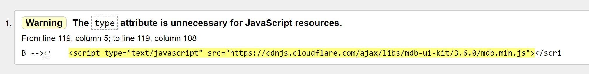

# Testing Documentation

This website is for Milestone Project 3.
Built with HTML, CSS, JavaScript and Python.

To go back to README :point_right: [README.md](README.md)

# Testing Plan

Testing required:
* responsiveness of all elements on all pages(both for logged and logged out users) 
* all users stories included in this README file
* links on pages must work properly and redirect to correct pages.
* code must pass the HTML, CSS, JS and python(PEP8) Validators

# Responsivnes Testing

|Screen size\Browser |Chrome            |Opera             |Edge              |Firefox           |Safari            
|--------------------|------------------|------------------|------------------|------------------|------------------| 
|Mobile              |:white_check_mark:|:white_check_mark:|:white_check_mark:|:white_check_mark:|:white_check_mark:|
|Tablet              |:white_check_mark:|:white_check_mark:|:white_check_mark:|:white_check_mark:|Not Tested        |
|Desktop             |:white_check_mark:|:white_check_mark:|:white_check_mark:|:white_check_mark:|:white_check_mark:|

The website was tested on a varied number of devices:
### For Mobiles:
* Android - Samsung Galaxy S10 (screen size - 6.1-inch) on Chrome, Opera, Firefox and Microsoft Edge
* IOS - iPhone 7 (screen size - 4.7-inch) on Safari and Chrome
* IOS - iphone Pro 12 (screen size 6.1-inch) Safari adn chrome
### For Tablet:
* Surface Book in tablet view - Chrome, Opera, Firefox, Edge (screen size - 13.5- inch)
* Amazon Firde Hd 10(screen-size 10-inch) - Chrome
### For Desktop:
* PC Windows (Windows 10):
  1. Surface Book on (screen size - 13.5-inch)
  2. Surface Book on the second monitor DELL U2419H(screen size - 24-inch)
  3. Huawei matebook D15(screen size 15.6-inch)  
   
  Tested on  Chrome, Opera, Firefox and Microsoft Edge
* MacBook pro 13:
  * Tested on Safari and Chrome browser.

  
Also, friends and family were asked to test this website and I did not receive any information on noticed bugs in the feedback from them.
# Validators Test

### HTML Validator - Test

HTML Validator - [W3C HTML Validator](https://validator.w3.org/) - PASS

 Comments: Tested by pasting below urls to the validator:
 * [Home](https://climbing-buddy-project.herokuapp.com/) - PASS
 * [Events](https://climbing-buddy-project.herokuapp.com/events) - PASS
 * [Register](https://climbing-buddy-project.herokuapp.com/register) - PASS
 * [Login](https://climbing-buddy-project.herokuapp.com/login) - PASS

Errors: Fixed.

Warning left: 

### CSS Validator - Test 

CSS Validator - [W3C CSS Validator](https://jigsaw.w3.org/css-validator/) - PASS

Comments: Tested by direct input and copying CSS from my project.

### JavaScript Validator - Test 

JS Validator  - [JSHint Validator](https://jshint.com/) - PASS

 Comments: Fixed issues.

 ### Python PEP8 Validator - Test

 [PEP8 Validator](http://pep8online.com/) - PASS

Comments: Tested and fixed all spacing and empty spaces.

# Performance
### To improve and check performance for this website I used [Lighthouse](https://developers.google.com/web/tools/lighthouse), which is part of [Chrome Developer Tools](https://developers.google.com/web/tools/chrome-devtools).

