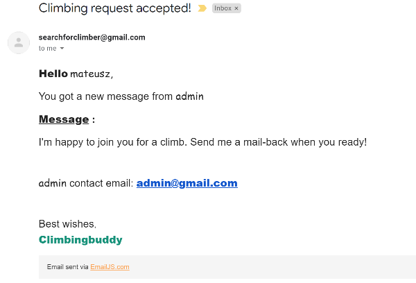

# Testing Documentation

This website is for Milestone Project 3.
Built with HTML, CSS, JavaScript and Python.

To go back to README :point_right: [README.md](README.md)

# Testing Plan

Testing required:
* responsiveness of all elements on all pages(both for logged and logged out users) 
* all users stories included in this README file
* site owner goals
* links on pages must work properly and redirect to correct pages.
* code must pass the HTML, CSS, JS and python(PEP8) Validators

# Responsivnes Testing

|Screen size\Browser |Chrome            |Opera             |Edge              |Firefox           |Safari            
|--------------------|------------------|------------------|------------------|------------------|------------------| 
|Mobile              |:white_check_mark:|:white_check_mark:|:white_check_mark:|:white_check_mark:|:white_check_mark:|
|Tablet              |:white_check_mark:|:white_check_mark:|:white_check_mark:|:white_check_mark:|Not Tested        |
|Desktop             |:white_check_mark:|:white_check_mark:|:white_check_mark:|:white_check_mark:|:white_check_mark:|

The website was tested on a varied number of devices:
### For Mobiles:
* Android - Samsung Galaxy S10 (screen size - 6.1-inch) on Chrome, Opera, Firefox and Microsoft Edge
* IOS - iPhone 7 (screen size - 4.7-inch) on Safari and Chrome
* IOS - iphone Pro 12 (screen size 6.1-inch) Safari adn chrome
### For Tablet:
* Surface Book in tablet view - Chrome, Opera, Firefox, Edge (screen size - 13.5- inch)
* Amazon Firde Hd 10(screen-size 10-inch) - Chrome
### For Desktop:
* PC Windows (Windows 10):
  1. Surface Book on (screen size - 13.5-inch)
  2. Surface Book on the second monitor DELL U2419H(screen size - 24-inch)
  3. Huawei matebook D15(screen size 15.6-inch)  
   
  Tested on  Chrome, Opera, Firefox and Microsoft Edge
* MacBook pro 13:
  * Tested on Safari and Chrome browser.

  
Also, friends and family were asked to test this website and I did not receive any information on noticed bugs in the feedback from them.
# Validators Test

### HTML Validator - Test

HTML Validator - [W3C HTML Validator](https://validator.w3.org/) - PASS

 Comments: Tested by pasting below urls to the validator:
 * [Home](https://climbing-buddy-project.herokuapp.com/) - PASS
 * [Events](https://climbing-buddy-project.herokuapp.com/events) - PASS
 * [Register](https://climbing-buddy-project.herokuapp.com/register) - PASS
 * [Login](https://climbing-buddy-project.herokuapp.com/login) - PASS

Errors: Fixed.

Warning left: 

### CSS Validator - Test 

CSS Validator - [W3C CSS Validator](https://jigsaw.w3.org/css-validator/) - PASS

Comments: Tested by direct input and copying CSS from my project.

### JavaScript Validator - Test 

JS Validator  - [JSHint Validator](https://jshint.com/) - PASS

 Comments: Fixed issues.

 ### Python PEP8 Validator - Test

 [PEP8 Validator](http://pep8online.com/) - PASS

Comments: Tested and fixed all spacing and empty spaces.

# Performance Test
### To improve and check performance for this website I used [Lighthouse](https://developers.google.com/web/tools/lighthouse), which is part of [Chrome Developer Tools](https://developers.google.com/web/tools/chrome-devtools).

* Test for user not logged:
1. Home page :heavy_check_mark:

2. Events page  :heavy_check_mark:
3. Register page :heavy_check_mark:
4. Login page :heavy_check_mark:

* Test performance for admin logged in:
1. Home page :heavy_check_mark:
2. Events :heavy_check_mark:
3. Find climber :
    * edit climb :heavy_check_mark:
    * add climb :heavy_check_mark:
    * contact climber :heavy_check_mark:
4. Profile :heavy_check_mark:

Comments: Update colour palette after testing(chnage from #f2f2f2 to #fafafa) and add meta description and set logo img size.

# Users Stories Test

1. As a user, I want to understand the purpose of this website.
*  On arrival to the home page, the user can find the title of the page with description and two buttons. One to register and the other for login.There are also navbar links for events,register and login. And in the footer an icon with anchor email link to contact the site owner. 

2. As a user, I want to find an easy navigate website and find all the content.
 * For unregistered users:
    - navbar with links for Home,Events,Register and Login pages.
    - login available from home page and a link under register form.
    - register button available on home page and link under login form.

* For registered users:
     - navbar with links for Home,Events,Find Climber, Profile and Logout functionality.
     - add climb,filter climbs and functionality to respond to climbing request on "Find Climber" page.
     - profile with username and email
     - events page with search words in events cards. 
     - places autocomplete for all locations input fields for better user experience.

3. As a user, I want the website to be responsive and allow me to use it comfortably on all size devices(particularly mobiles phones).
* [Responsivnes Testing](#responsivnes-testing)

4. As a user, I want to be able to register to the website and then create a request to look for a climbing partner.
    - registration button on home page available and working
    - navbar with registration link on all pages available and tested
    - registration link under login form tested

    Looking for climbing partner:
    - Find Climber in navbar link available and tested from all pages.
    - add climb within "Find Climber" page tested and working
    - delete,edit and add climb functionality tested.

5. As a user, I want to see if anyone created a request for a climbing partner.

    - Find Climber list of climbs available with the date of climb name, type of climbing, and if the equipment is provided available.

    - button to get more info tested and working

    - inside more info "read climber message working

    - contact climber opening modal with focus on message working.

    - send a message in modal giving confirmation of the message sent.

     

6. As a user, I want to be able to select the requirements I have for a climbing person I'm looking for(skills, equipment and what type of climbing I want to do that day).

    - from the Find Climber link button add climb working

    - inside add climb page: date, climbing type, providing equipment switch button and message input field available.

7. As a user, I would like to get notified once a person accepted my request.
    - an email with the user name, message and interested user email address would be send using email.js.

8. As a user, I want to find about any climbing events taking place.
    - event page available for all website users with a search bar to look for words in the events cards tested and working.
    Comments(admin add event climb functionality tested and working)

9. As a user, I want to be able to contact the site owner for any questions or suggestions I might have.
    - email link icon available on all pages in the footer tested for registered and unregistered users.

# Site Goals Test

1. To provide users with a simple- and easily navigated website to help them to create a request to find the correct partner for the climbing day. :heavy_check_mark:

2. To increase the number of climbing events and allowing participating expanding network of new friends who share the same passion. 

    - events page with search for words in events cards functionality :heavy_check_mark:

    - add an event for the admin user :heavy_check_mark:

    - edit and delete event functionality for admin :heavy_check_mark:

    - add climb for registed user :heavy_check_mark:

    - delete your own climb(and any climb for admin user) :heavy_check_mark:

    - edit your own climb :heavy_check_mark:

    - contact another climber to respond to the request :heavy_check_mark:

3. Create a website fully responsive on mobiles, tablets, and desktop devices.
    * [Responsivnes Testing](#responsivnes-testing)

# Links Testing

 1. Navbar links:

 - Tested during user and site goals testing from all pages(for registered, unregistered and admin login) :heavy_check_mark:

 2. Email link:

 - tested on all pages(for logged users,admin login and unregistered users) :heavy_check_mark:

 3. Login links:

 - Tested during user and site goals testing :heavy_check_mark:

 4. Registration links:

 - Tested during user and site goals testing :heavy_check_mark:

 5. Logo image link:

 - after pressing logo, the user is being redirected to the home page(for logged users it would be different content then for not logged users) :heavy_check_mark:

 - Tested on all pages(for logged users,admin login and unregistered users) :heavy_check_mark:
